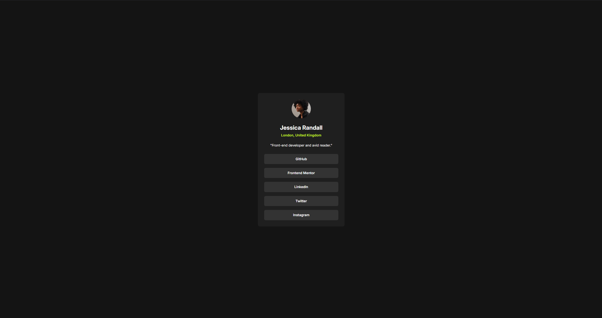
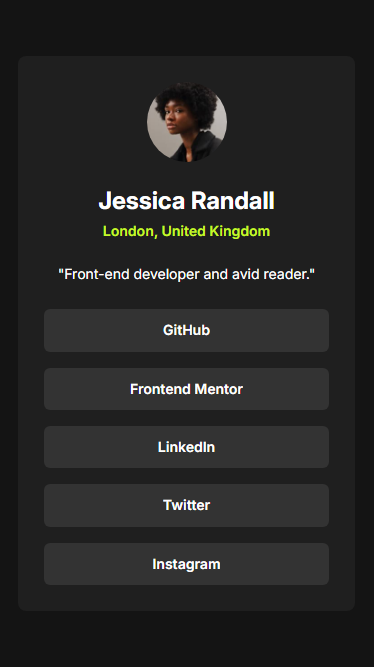

# Frontend Mentor - Social links profile

This is a solution to the [Social links profile](https://www.frontendmentor.io/challenges/social-links-profile-UG32l9m6dQ). Frontend Mentor challenges help you improve your coding skills by building realistic projects. 

## Table of contents

- [Overview](#overview)
  - [Screenshot](#screenshot)
  - [Links](#links)
- [My process](#my-process)
  - [Built with](#built-with)
- [Author](#author)

## Overview

### Screenshot
- ### Desktop

- ### Mobile 

### Links

- Live Site URL: [Click here](https://undecodev.github.io/frontend-mentor/social-links-profile/)

## My process

### Built with

- Semantic HTML5 markup
- BEM
- CSS custom properties
- Flexbox
- CSS Grid
- Mobile-first workflow

## Author

- Frontend Mentor - [@UndeCodev](https://www.frontendmentor.io/profile/UndeCodev)
